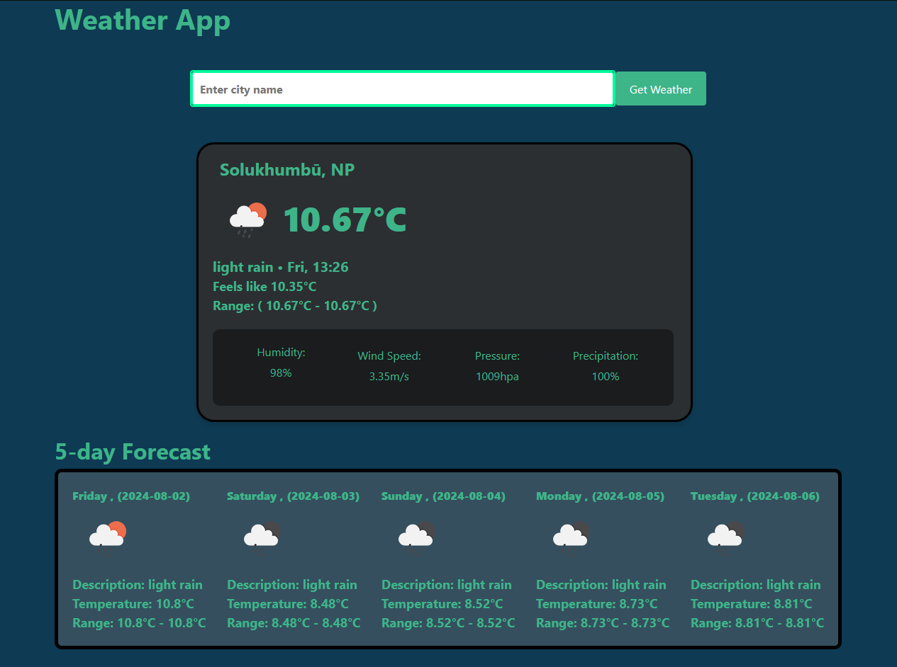

# Weather-App
Django temperature fetching app with OpenWeather API.

### Description

The Weather App is a simple application that allows users to check the current weather conditions and a 5-day forecast for a specified location. The app uses the OpenWeather API to fetch and display weather data, including temperature, humidity, wind speed, and weather descriptions.

## Features

   - Search for current weather by city name.
   - Display temperature, humidity, wind speed, and weather description.
   - 5-day weather forecast with daily summaries.
   - Responsive design for use on various devices.

## Technologies Used

  - HTML5
  - CSS3
  - python
  - bootstrap
  - OpenWeather API
  
## Screenshots
<div align="center">
  
</div>
<br>


## Getting Started
### Prerequisites

To run the Weather App, you need to have the following installed on your local machine:

   - A modern web browser (e.g., Chrome, Firefox, Safari)
   - look in requirements.txt
   - create an account in OpenWeather to get API
   - Store your API in a separate file or store it in API_KEY variable

### Installation

   **Clone the repository:**

``` sh
git clone https://github.com/NoahXiren/Weather-App.git
```
**Navigate to the project directory:**

```sh
cd weather
```
**Configuration**

 - Sign up at OpenWeather and get your API key.
 - replace API_KEY with your actual OpenWeather API key:
```python
    API_KEY = "Your_API_KEY"
    or
    API_KEY = "path to API_KEY_file"
```
## Usage

   - Enter the name of the city you want to check the weather for in the input field.
   - Click the "get weather" button to fetch and display the current weather data and the 5-day forecast for the specified city.


## License

This project is licensed under the MIT License. See the [LICENSE](LICENSE) file for details.


## Acknowledgements
OpenWeather for providing the weather API.


